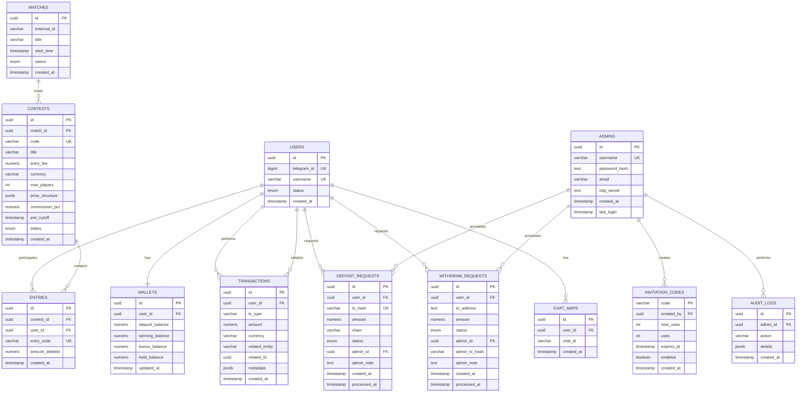

# CricAlgo Database Entity Relationship Diagram

## Database Schema Overview

The CricAlgo database consists of 8 main tables with proper relationships and constraints. The schema is designed to handle user management, financial transactions, contest participation, and audit logging.

## Entity Relationship Diagram

## Table Descriptions

### Core User Tables

#### USERS
- **Purpose**: Stores user account information
- **Key Fields**: `telegram_id` (unique), `username`, `status`
- **Relationships**: One-to-one with WALLETS, one-to-many with ENTRIES, TRANSACTIONS
- **Constraints**: Unique telegram_id and username

#### WALLETS
- **Purpose**: Manages user financial balances
- **Key Fields**: `deposit_balance`, `winning_balance`, `bonus_balance`, `held_balance`
- **Relationships**: Belongs to USERS
- **Constraints**: All balances must be >= 0

### Contest System Tables

#### MATCHES
- **Purpose**: Represents cricket matches
- **Key Fields**: `external_id`, `title`, `start_time`, `status`
- **Relationships**: One-to-many with CONTESTS

#### CONTESTS
- **Purpose**: Represents betting contests for matches
- **Key Fields**: `code` (unique), `entry_fee`, `max_players`, `prize_structure`, `status`
- **Relationships**: Belongs to MATCHES, one-to-many with ENTRIES
- **Constraints**: Entry fee must be >= 0

#### ENTRIES
- **Purpose**: Records user participation in contests
- **Key Fields**: `entry_code` (unique), `amount_debited`
- **Relationships**: Belongs to CONTESTS and USERS
- **Constraints**: Unique combination of contest_id and user_id

### Financial System Tables

#### TRANSACTIONS
- **Purpose**: Audit trail for all financial operations
- **Key Fields**: `tx_type`, `amount`, `currency`, `related_entity`, `metadata`
- **Relationships**: Belongs to USERS (optional)
- **Constraints**: Amount must be > 0

#### DEPOSIT_REQUESTS
- **Purpose**: Manages user deposit requests
- **Key Fields**: `tx_hash` (unique), `amount`, `status`
- **Relationships**: Belongs to USERS, processed by ADMINS
- **Constraints**: Unique tx_hash

#### WITHDRAW_REQUESTS
- **Purpose**: Manages user withdrawal requests
- **Key Fields**: `to_address`, `amount`, `status`, `admin_tx_hash`
- **Relationships**: Belongs to USERS, processed by ADMINS
- **Constraints**: Amount must be > 0

### Administrative Tables

#### ADMINS
- **Purpose**: Administrative user accounts
- **Key Fields**: `username` (unique), `password_hash`, `totp_secret`
- **Relationships**: One-to-many with various request tables

#### INVITATION_CODES
- **Purpose**: Manages user invitation system
- **Key Fields**: `code` (primary key), `max_uses`, `uses`, `expires_at`
- **Relationships**: Created by ADMINS

#### AUDIT_LOGS
- **Purpose**: Logs administrative actions
- **Key Fields**: `action`, `details`
- **Relationships**: Performed by ADMINS

#### CHAT_MAPS
- **Purpose**: Maps users to Telegram chat IDs
- **Key Fields**: `user_id`, `chat_id`
- **Relationships**: Belongs to USERS

## Database Constraints

### Check Constraints
- `chk_deposit_nonneg`: `deposit_balance >= 0`
- `chk_winning_nonneg`: `winning_balance >= 0`
- `chk_bonus_nonneg`: `bonus_balance >= 0`
- `chk_held_nonneg`: `held_balance >= 0`
- `chk_entry_fee_nonneg`: `entry_fee >= 0`
- `chk_amount_debited_nonneg`: `amount_debited >= 0`

### Unique Constraints
- `users.telegram_id` - Unique
- `users.username` - Unique
- `wallets.user_id` - Unique (one wallet per user)
- `contests.code` - Unique
- `entries.entry_code` - Unique
- `entries.(contest_id, user_id)` - Unique (one entry per user per contest)
- `deposit_requests.tx_hash` - Unique
- `invitation_codes.code` - Primary key

### Foreign Key Constraints
- `wallets.user_id` → `users.id` (CASCADE DELETE)
- `entries.contest_id` → `contests.id` (CASCADE DELETE)
- `entries.user_id` → `users.id` (CASCADE DELETE)
- `contests.match_id` → `matches.id` (CASCADE DELETE)
- `transactions.user_id` → `users.id` (SET NULL)
- `deposit_requests.user_id` → `users.id` (CASCADE DELETE)
- `withdraw_requests.user_id` → `users.id` (CASCADE DELETE)
- `deposit_requests.admin_id` → `admins.id` (SET NULL)
- `withdraw_requests.admin_id` → `admins.id` (SET NULL)
- `invitation_codes.created_by` → `admins.id` (SET NULL)
- `audit_logs.admin_id` → `admins.id` (SET NULL)
- `chat_maps.user_id` → `users.id` (CASCADE DELETE)

## Indexes

### Performance Indexes
- `idx_users_telegram_id` - Fast user lookup by Telegram ID
- `idx_deposit_requests_status` - Fast deposit request filtering
- `idx_withdraw_requests_status` - Fast withdrawal request filtering
- `idx_contests_match_id` - Fast contest lookup by match
- `idx_entries_contest_id` - Fast entry lookup by contest
- `idx_transactions_user_id` - Fast transaction lookup by user

### Recommended Additional Indexes
- `idx_contests_status` - For filtering contests by status
- `idx_entries_user_id` - For user contest history
- `idx_transactions_tx_type` - For transaction type filtering
- `idx_transactions_created_at` - For time-based queries
- `idx_audit_logs_admin_id` - For admin action tracking
- `idx_audit_logs_created_at` - For time-based audit queries

## Data Types and Enums

### Enums
- `user_status`: ACTIVE, FROZEN, DISABLED
- `contest_status`: scheduled, open, closed, cancelled, settled
- `deposit_status`: pending, approved, rejected
- `withdraw_status`: pending, paid, failed, cancelled

### Key Data Types
- `UUID`: Primary keys for all tables
- `NUMERIC(30,8)`: Financial amounts with high precision
- `JSONB`: Flexible data storage (prize_structure, metadata, details)
- `TIMESTAMP WITH TIME ZONE`: All timestamps with timezone support

## Business Rules

### Financial Operations
1. Users can only withdraw from `winning_balance`
2. Contest entry fees are debited from `deposit_balance` first, then `bonus_balance`, then `winning_balance`
3. All financial operations must be logged in TRANSACTIONS table
4. Withdrawal requests hold funds in `held_balance` until approved

### Contest Rules
1. Users can only join a contest once
2. Contest status must be "open" to join
3. Contest must not exceed `max_players` limit
4. Contest settlement distributes prizes to `winning_balance`

### Security Rules
1. All admin actions must be logged in AUDIT_LOGS
2. User data is linked by `telegram_id` for bot operations
3. Financial operations require proper authentication
4. Invitation codes have usage limits and expiration dates

## Migration History

The database schema has evolved through several migrations:

1. **0001_initial.py**: Initial schema creation
2. **0003_deposit_processed_flag.py**: Added processed flag to deposits
3. **0004_contest_settlement.py**: Added settlement functionality
4. **0005_normalize_contests_schema.py**: Normalized contest structure
5. **20250921150419_normalize_contest_transaction_enums.py**: Enum normalization
6. **51656e27311c_add_winner_rank_to_contest_entries.py**: Added winner ranking
7. **a199f1aba872_fix_contest_status_enum.py**: Fixed contest status enum

## Performance Considerations

### Query Optimization
- Use proper indexes for frequently queried columns
- Consider partitioning for large tables (TRANSACTIONS, AUDIT_LOGS)
- Implement connection pooling for database connections
- Use read replicas for reporting queries

### Data Retention
- Implement data retention policies for audit logs
- Archive old transactions after a certain period
- Consider partitioning by date for time-series data
- Implement proper backup and recovery procedures

### Scalability
- Consider sharding by user_id for large user bases
- Implement proper caching for frequently accessed data
- Use database connection pooling
- Monitor query performance and optimize slow queries

## Security Considerations

### Data Protection
- All financial data is encrypted at rest
- User passwords are properly hashed
- Sensitive data is not logged in plain text
- Proper access controls for admin functions

### Audit Trail
- All financial operations are logged
- Admin actions are tracked
- User actions are recorded
- System changes are documented

### Compliance
- Financial transaction logging for compliance
- User data protection measures
- Audit trail for regulatory requirements
- Data retention policies for legal compliance
