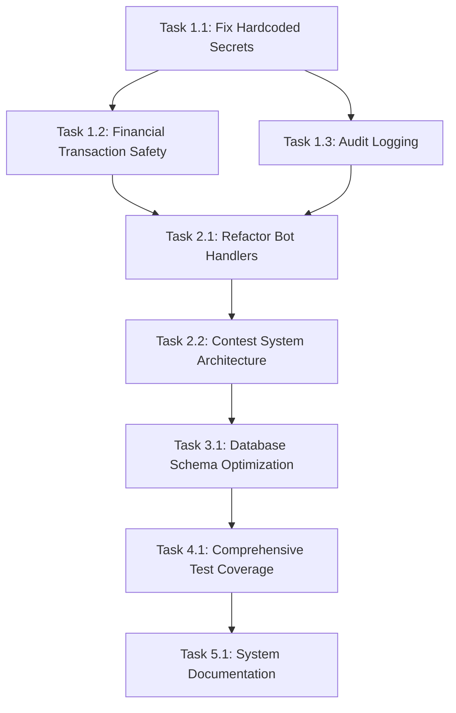

# CricAlgo Refactor Tasks

## Priority 1: Critical Security & Stability (Week 1-2)

### Task 1.1: Fix Hardcoded Secrets
- **Files Affected**: `app/core/config.py`, `.env.example`
- **Description**: Move all hardcoded secrets to environment variables and implement proper secret management
- **Test Requirements**: Add tests to ensure no secrets are hardcoded
- **Estimated Effort**: Small (2-3 days)
- **Owner**: Security Team

### Task 1.2: Add Financial Transaction Safety
- **Files Affected**: `app/repos/wallet_repo.py`, `app/repos/contest_repo.py`, `app/api/v1/wallet.py`
- **Description**: Implement comprehensive error handling, rollback mechanisms, and transaction validation for all financial operations
- **Test Requirements**: Add integration tests for error scenarios and rollback mechanisms
- **Estimated Effort**: Medium (1 week)
- **Owner**: Backend Team

### Task 1.3: Implement Audit Logging
- **Files Affected**: `app/models/audit_log.py`, `app/repos/audit_log_repo.py`, all financial operation files
- **Description**: Add comprehensive audit logging for all financial transactions and user actions
- **Test Requirements**: Add tests to verify audit log creation and data integrity
- **Estimated Effort**: Medium (1 week)
- **Owner**: Backend Team

### Task 1.4: Add Security Scanning to CI/CD
- **Files Affected**: `.github/workflows/ci.yml`, `requirements.txt`
- **Description**: Add security scanning tools (bandit, safety) to CI/CD pipeline
- **Test Requirements**: Ensure security scans pass in CI
- **Estimated Effort**: Small (1-2 days)
- **Owner**: DevOps Team

## Priority 2: Architecture Improvements (Week 3-6)

### Task 2.1: Refactor Bot Handlers
- **Files Affected**: `app/bot/handlers/commands.py`, `app/bot/handlers/callbacks.py`, `app/bot/handlers/unified_callbacks.py`
- **Description**: Split bot handlers by responsibility (auth, wallet, contests) and extract business logic to service layer
- **Test Requirements**: Add comprehensive unit tests for each handler module
- **Estimated Effort**: Large (2-3 weeks)
- **Owner**: Bot Team

### Task 2.2: Improve Contest System Architecture
- **Files Affected**: `app/repos/contest_repo.py`, `app/services/settlement.py`, `app/tasks/tasks.py`
- **Description**: Refactor contest operations into separate modules (contest_operations, contest_settlement, contest_payouts)
- **Test Requirements**: Add comprehensive integration tests for contest lifecycle
- **Estimated Effort**: Large (2-3 weeks)
- **Owner**: Backend Team

### Task 2.3: Add Comprehensive Error Handling
- **Files Affected**: All API endpoints, bot handlers, and service files
- **Description**: Implement consistent error handling patterns across the application
- **Test Requirements**: Add tests for all error scenarios
- **Estimated Effort**: Medium (1-2 weeks)
- **Owner**: Backend Team

### Task 2.4: Implement Rate Limiting
- **Files Affected**: `app/middleware/rate_limit.py`, `app/bot/telegram_bot.py`, all API endpoints
- **Description**: Add proper rate limiting for bot commands and API endpoints
- **Test Requirements**: Add tests for rate limiting functionality
- **Estimated Effort**: Medium (1 week)
- **Owner**: Backend Team

## Priority 3: Database & Performance (Week 7-10)

### Task 3.1: Database Schema Optimization
- **Files Affected**: `alembic/versions/`, `app/models/`, `scripts/database/`
- **Description**: Add missing indexes, implement soft delete, add data retention policies
- **Test Requirements**: Add performance tests for database operations
- **Estimated Effort**: Medium (1-2 weeks)
- **Owner**: Database Team

### Task 3.2: Add Monitoring and Alerting
- **Files Affected**: `app/main.py`, `monitoring/`, `k8s/`
- **Description**: Implement comprehensive monitoring, alerting, and observability
- **Test Requirements**: Add tests for monitoring functionality
- **Estimated Effort**: Medium (1-2 weeks)
- **Owner**: DevOps Team

### Task 3.3: Performance Testing
- **Files Affected**: `load/`, `tests/`, `.github/workflows/`
- **Description**: Add load testing and performance benchmarking to CI/CD
- **Test Requirements**: Add performance test suites
- **Estimated Effort**: Medium (1-2 weeks)
- **Owner**: QA Team

## Priority 4: Testing & Quality (Week 11-14)

### Task 4.1: Comprehensive Test Coverage
- **Files Affected**: `tests/`, all application files
- **Description**: Add comprehensive test coverage for all financial flows and edge cases
- **Test Requirements**: Achieve 90%+ test coverage
- **Estimated Effort**: Large (2-3 weeks)
- **Owner**: QA Team

### Task 4.2: Add Security Testing
- **Files Affected**: `tests/`, `.github/workflows/`
- **Description**: Add security testing and vulnerability scanning
- **Test Requirements**: Add security test suites
- **Estimated Effort**: Medium (1-2 weeks)
- **Owner**: Security Team

### Task 4.3: Improve Test Infrastructure
- **Files Affected**: `tests/conftest.py`, `tests/fixtures/`
- **Description**: Improve test fixtures, add test data management, and enhance test isolation
- **Test Requirements**: Improve test reliability and performance
- **Estimated Effort**: Medium (1-2 weeks)
- **Owner**: QA Team

## Priority 5: Documentation & Maintenance (Week 15-18)

### Task 5.1: Create System Documentation
- **Files Affected**: `docs/`, `README.md`
- **Description**: Create comprehensive system architecture documentation, API documentation, and deployment guides
- **Test Requirements**: Add documentation testing
- **Estimated Effort**: Medium (1-2 weeks)
- **Owner**: Documentation Team

### Task 5.2: Improve Development Workflow
- **Files Affected**: `Makefile`, `scripts/`, `.github/workflows/`
- **Description**: Improve development workflow, add automation, and enhance developer experience
- **Test Requirements**: Add workflow testing
- **Estimated Effort**: Small (1 week)
- **Owner**: DevOps Team

### Task 5.3: Code Quality Improvements
- **Files Affected**: All application files
- **Description**: Improve code quality, add linting, and implement coding standards
- **Test Requirements**: Add code quality tests
- **Estimated Effort**: Medium (1-2 weeks)
- **Owner**: Development Team

## Task Dependencies

## Success Criteria

### Phase 1 (Week 1-2)
- ✅ All secrets moved to environment variables
- ✅ Financial operations have proper error handling
- ✅ Audit logging implemented for all financial transactions
- ✅ Security scanning added to CI/CD

### Phase 2 (Week 3-6)
- ✅ Bot handlers refactored and modularized
- ✅ Contest system architecture improved
- ✅ Consistent error handling across application
- ✅ Rate limiting implemented

### Phase 3 (Week 7-10)
- ✅ Database schema optimized
- ✅ Monitoring and alerting implemented
- ✅ Performance testing added

### Phase 4 (Week 11-14)
- ✅ 90%+ test coverage achieved
- ✅ Security testing implemented
- ✅ Test infrastructure improved

### Phase 5 (Week 15-18)
- ✅ Comprehensive documentation created
- ✅ Development workflow improved
- ✅ Code quality standards implemented

## Risk Mitigation

### High-Risk Tasks
- **Task 1.2**: Financial Transaction Safety - Test thoroughly in staging
- **Task 2.1**: Bot Handler Refactoring - Implement feature flags
- **Task 3.1**: Database Schema Optimization - Use blue-green deployment

### Medium-Risk Tasks
- **Task 2.2**: Contest System Architecture - Implement gradual migration
- **Task 4.1**: Comprehensive Test Coverage - Add tests incrementally

### Low-Risk Tasks
- **Task 1.1**: Fix Hardcoded Secrets - Low impact, high value
- **Task 5.1**: System Documentation - No production impact

## Resource Requirements

### Team Allocation
- **Security Team**: 1 person for security-related tasks
- **Backend Team**: 2-3 people for core development
- **Bot Team**: 1-2 people for bot-specific tasks
- **QA Team**: 1-2 people for testing and quality
- **DevOps Team**: 1 person for infrastructure and CI/CD
- **Documentation Team**: 1 person for documentation

### Timeline
- **Total Duration**: 18 weeks
- **Critical Path**: 12 weeks (Tasks 1.1 → 1.2 → 2.1 → 2.2 → 3.1 → 4.1)
- **Parallel Work**: Tasks can be done in parallel where dependencies allow

## Monitoring and Reporting

### Weekly Reviews
- Review task progress and blockers
- Assess risk and adjust timeline
- Review quality metrics and test coverage

### Monthly Reviews
- Review overall progress against goals
- Assess team capacity and resource needs
- Review security and quality metrics

### Success Metrics
- **Security**: Zero hardcoded secrets, 100% security scan pass rate
- **Quality**: 90%+ test coverage, zero critical bugs
- **Performance**: <200ms API response time, <1s bot response time
- **Maintainability**: Reduced cyclomatic complexity, improved code organization
