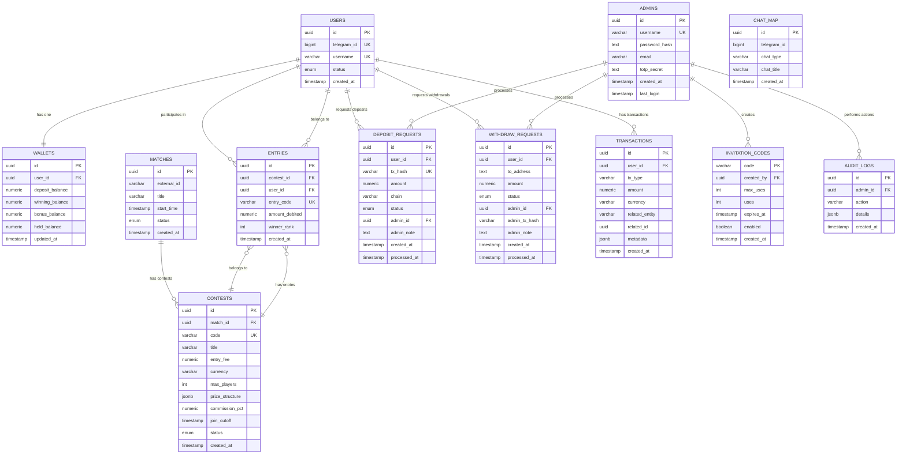

# CricAlgo Database Architecture

## Visual Database Schema

## Key Features

### Core Entities
- **Users**: Telegram-based user accounts with unique telegram_id
- **Wallets**: Three-bucket system (deposit, winning, bonus) + held balance
- **Matches**: Cricket matches with external integration support
- **Contests**: Betting contests linked to matches with flexible prize structures

### Financial System
- **Multi-bucket wallet system** for different balance types
- **Transaction ledger** for complete audit trail
- **Deposit/Withdrawal requests** with admin approval workflow
- **Commission tracking** for platform revenue

### Admin Management
- **Admin accounts** with TOTP support
- **Invitation codes** for user registration control
- **Audit logging** for all admin actions
- **Request processing** for deposits/withdrawals

### Data Integrity
- **Unique constraints** on critical fields
- **Check constraints** for non-negative balances
- **Foreign key relationships** with proper cascading
- **Indexes** on frequently queried fields

## Database Design Principles

1. **UUID Primary Keys**: All entities use UUID for security and scalability
2. **Audit Trail**: Complete transaction history with metadata
3. **Flexible Prize Structure**: JSON-based prize distribution
4. **Multi-currency Support**: USDT as primary with extensibility
5. **Admin Controls**: Comprehensive admin management and audit
6. **Performance**: Strategic indexing for common queries
